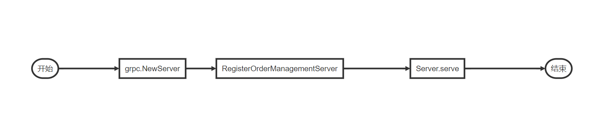
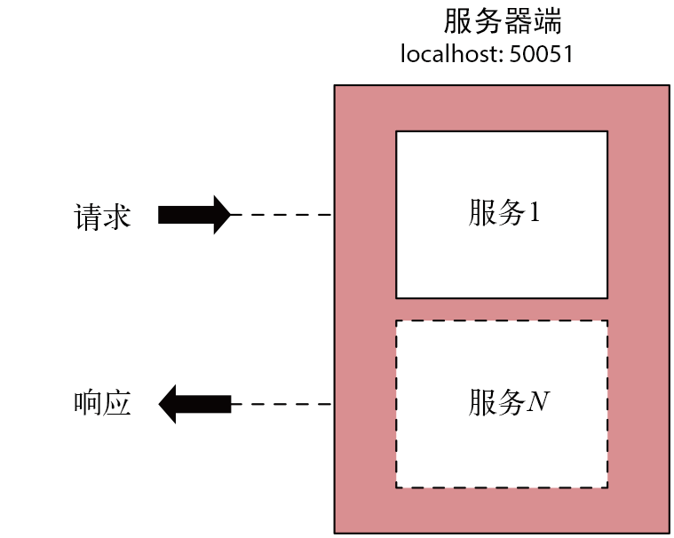

### gRPC高级进阶


#### gRPC服务端启动流程



```go
func main() {
	// listen the tcp port
	lis, err := net.Listen("tcp", port)
	if err != nil {
		log.Fatalf("failed to listen: %v", err)
	}
	
    //	111111
	s := grpc.NewServer(grpc.UnaryInterceptor(interceptors.OrderUnaryServerInterceptor1),
		grpc.ChainUnaryInterceptor(interceptors.OrderUnaryServerInterceptor2, interceptors.OrderUnaryServerInterceptor3))												
	
    //	222222
	pb.RegisterOrderManagementServer(s, svc.NewServer())
    
	log.Printf("Starting gRPC listener on port " + port)
    
	//	333333
	if err := s.Serve(lis); err != nil {
		log.Fatalf("failed to serve: %v", err)
	}
}
```

> step 1

```go
func NewServer(opt ...ServerOption) *Server {
	/*	
	创建grpc server
	*/
	}
```

> step 2

```go
// New服务实例 注册到之前初始化好的空gRPC server（s）中
func RegisterOrderManagementServer(s grpc.ServiceRegistrar, srv OrderManagementServer){
    /*
	新建一个实现好的服务实例
	根据 proto生成的grpc.ServiceDesc信息 和 服务实例 创建serviceInfo
			（\google.golang.org\grpc@v1.38.0\server.go==》Line 102）
	将serviceInfo添加到gRPC server 的services（map）中
	*/
}
```

> step 3

```go
func (s *Server) Serve(lis net.Listener) {
    /*
	循环接受tcp listen的请求
	开启协程处理每一个请求
	*/
}
```


#### 服务端拦截器


##### UnaryServerInterceptor工作流程

###### 服务端启动工作

[NewServer](https://github.com/grpc/grpc-go/blob/v1.38.0/server.go#L561)代码

```go
// NewServer creates a gRPC server which has no service registered and has not
// started to accept requests yet.
func NewServer(opt ...ServerOption) *Server {
	opts := defaultServerOptions
	for _, o := range opt {
		o.apply(&opts)
	}
	s := &Server{
		lis:      make(map[net.Listener]bool),
		opts:     opts,
		conns:    make(map[string]map[transport.ServerTransport]bool),
		services: make(map[string]*serviceInfo),
		quit:     grpcsync.NewEvent(),
		done:     grpcsync.NewEvent(),
		czData:   new(channelzData),
	}
	chainUnaryServerInterceptors(s)		// ★
	chainStreamServerInterceptors(s) 	// ★
	s.cv = sync.NewCond(&s.mu)
	if EnableTracing {
		_, file, line, _ := runtime.Caller(1)
		s.events = trace.NewEventLog("grpc.Server", fmt.Sprintf("%s:%d", file, line))
	}

	if s.opts.numServerWorkers > 0 {
		s.initServerWorkers()
	}

	if channelz.IsOn() {
		s.channelzID = channelz.RegisterServer(&channelzServer{s}, "")
	}
	return s
}
```


[defaultServerOptions](https://github.com/grpc/grpc-go/blob/v1.38.0/server.go#L170)  type : [serverOptions](https://github.com/grpc/grpc-go/blob/v1.38.0/server.go#L143)

```go
var defaultServerOptions = serverOptions{
	maxReceiveMessageSize: defaultServerMaxReceiveMessageSize,
	maxSendMessageSize:    defaultServerMaxSendMessageSize,
	connectionTimeout:     120 * time.Second,
	writeBufferSize:       defaultWriteBufSize,
	readBufferSize:        defaultReadBufSize,
}
========================
type serverOptions struct {
	...
	unaryInt              UnaryServerInterceptor		// 一元拦截器
	streamInt             StreamServerInterceptor		// 流拦截器
	chainUnaryInts        []UnaryServerInterceptor		// 一元拦截器链表
	chainStreamInts       []StreamServerInterceptor		// 流拦截器链表
	...
}
```


[chainUnaryServerInterceptors ](https://github.com/grpc/grpc-go/blob/v1.38.0/server.go#L1098) [chainStreamServerInterceptors](https://github.com/grpc/grpc-go/blob/v1.38.0/server.go#L1379)

```go
func chainUnaryServerInterceptors(s *Server) {
	// Prepend opts.unaryInt to the chaining interceptors if it exists, since unaryInt will
	// be executed before any other chained interceptors.
	interceptors := s.opts.chainUnaryInts
	if s.opts.unaryInt != nil {
        // 一元拦截器和一元拦截器链进行合并
		interceptors = append([]UnaryServerInterceptor{s.opts.unaryInt}, s.opts.chainUnaryInts...)
	}

	var chainedInt UnaryServerInterceptor
	if len(interceptors) == 0 {
		chainedInt = nil
	} else if len(interceptors) == 1 {
		chainedInt = interceptors[0]
	} else {
		chainedInt = func(ctx context.Context, req interface{}, info *UnaryServerInfo, handler UnaryHandler) (interface{}, error) {
			return interceptors[0](ctx, req, info, getChainUnaryHandler(interceptors, 0, info, handler))
		}
        // 将自定义拦截器替换成一个递归取自定义拦截器的函数
	}

	s.opts.unaryInt = chainedInt
}
===================
`chainStreamServerInterceptors`同理
```


开始处理服务 [Server.Serve](https://github.com/grpc/grpc-go/blob/v1.38.0/server.go#L746)方法 

```go
func (s *Server) Serve(lis net.Listener) error {
	...
		// Start a new goroutine to deal with rawConn so we don't stall this Accept
		// loop goroutine.
		//
		// Make sure we account for the goroutine so GracefulStop doesn't nil out
		// s.conns before this conn can be added.
		s.serveWG.Add(1)
		go func() {
			s.handleRawConn(lis.Addr().String(), rawConn)
			s.serveWG.Done()
		}()
	}
}
```

==>调用 [Server.handleRawConn](https://github.com/grpc/grpc-go/blob/v1.38.0/server.go#L836)方法 开启协程准备监听tcp请求

```go
// handleRawConn forks a goroutine to handle a just-accepted connection that
// has not had any I/O performed on it yet.
func (s *Server) handleRawConn(lisAddr string, rawConn net.Conn) {
	...
	go func() {
		s.serveStreams(st)
		s.removeConn(lisAddr, st)
	}()
}
```

###### 当时有请求进入时

==>调用 [Server.serveStreams](https://github.com/grpc/grpc-go/blob/v1.38.0/server.go#L913)方法，开启协程处理http请求，根据`Server.opts.numServerWorkers` 数量做负载均衡

```go
func (s *Server) serveStreams(st transport.ServerTransport) {
	...
		if s.opts.numServerWorkers > 0 {
			...
		} else {
			go func() {
				defer wg.Done()
				s.handleStream(st, stream, s.traceInfo(st, stream))
			}()
		}
	...
}
```

==>调用 [Server.handleStream](https://github.com/grpc/grpc-go/blob/v1.38.0/server.go#L1579)方法，解析方法URI，判断属于`UnaryRPC`还是`StreamingRPC`进行不同处理

```go

func (s *Server) handleStream(t transport.ServerTransport, stream *transport.Stream, trInfo *traceInfo) {
	sm := stream.Method()
	...
	srv, knownService := s.services[service]
	if knownService {
		if md, ok := srv.methods[method]; ok {
			s.processUnaryRPC(t, stream, srv, md, trInfo)
			return
		}
		if sd, ok := srv.streams[method]; ok {
			s.processStreamingRPC(t, stream, srv, sd, trInfo)
			return
		}
	}
	...
}
```

`UnaryRPC`  调用 [Server.processUnaryRPC](https://github.com/grpc/grpc-go/blob/v1.38.0/server.go#L1131)方法，`StreamingRPC` 调用 [Server.processStreamingRPC](https://github.com/grpc/grpc-go/blob/v1.38.0/server.go#L1412)方法，处理过程类似

```go
func (s *Server) processUnaryRPC(t transport.ServerTransport, stream *transport.Stream, info *serviceInfo, md *MethodDesc, trInfo *traceInfo) (err error) {
	...
   ctx := NewContextWithServerTransportStream(stream.Context(), stream)
   reply, appErr := md.Handler(info.serviceImpl, ctx, df, s.opts.unaryInt)
   if appErr != nil {
	...
}
```

`md.Handler`是gRPC生成的服务处理方法，下面是一个例子：

```go
func _OrderManagement_GetOrder_Handler(srv interface{}, ctx context.Context, dec func(interface{}) error, interceptor grpc.UnaryServerInterceptor) (interface{}, error) {
	in := new(wrapperspb.StringValue)
	if err := dec(in); err != nil {
		return nil, err
	}
	if interceptor == nil {
		return srv.(OrderManagementServer).GetOrder(ctx, in)
	}
	info := &grpc.UnaryServerInfo{
		Server:     srv,
		FullMethod: "/proto.OrderManagement/getOrder",
	}
    // 真正的service方法GetOrder实现
	handler := func(ctx context.Context, req interface{}) (interface{}, error) {
		return srv.(OrderManagementServer).GetOrder(ctx, req.(*wrapperspb.StringValue))
	}
	return interceptor(ctx, in, info, handler)
}
```

`interceptor`为空直接调用GetOrder方法，不为空先调用`Server.opts.unaryInt`处理请求。前面已经介绍过`Server.opts.unaryInt = chainedInt`，`Server.opts.unaryInt`会依次调用拦截器，最后才调用GetOrder方法


[getChainUnaryHandler](https://github.com/grpc/grpc-go/blob/v1.38.0/server.go#L1121)代码

```go
// 递归生成链式UnaryHandler
func getChainUnaryHandler(interceptors []UnaryServerInterceptor, curr int, info *UnaryServerInfo, finalHandler UnaryHandler) UnaryHandler {
	if curr == len(interceptors)-1 {
		return finalHandler
	}

	return func(ctx context.Context, req interface{}) (interface{}, error) {
		return interceptors[curr+1](ctx, req, info, getChainUnaryHandler(interceptors, curr+1, info, finalHandler))
	}
}
```


##### StreamServerInterceptor工作流程

整体流程一元拦截器一致

```go
func OrderServerStreamInterceptor(srv interface{}, ss grpc.ServerStream, info *grpc.StreamServerInfo, handler grpc.StreamHandler) error {
	// Pre-processing
	log.Println("====== [Server Stream Interceptor] ", info.FullMethod)

	// Invoking the StreamHandler to complete the execution of RPC invocation
	err := handler(srv, newWrappedStream(ss))
	if err != nil {
		log.Printf("RPC failed with error %v", err)
	}
	return err
}
```

[StreamHandler](https://github.com/grpc/grpc-go/blob/v1.38.0/stream.go#L53)：

```go
type StreamHandler func(srv interface{}, stream ServerStream) error
```

==>[ServerStream](https://github.com/grpc/grpc-go/blob/v1.38.0/stream.go#L1349)结构

```go
// All errors returned from ServerStream methods are compatible with the
// status package.
type ServerStream interface {

	SetHeader(metadata.MD) error

	SendHeader(metadata.MD) error

	SetTrailer(metadata.MD)

	Context() context.Context

	SendMsg(m interface{}) error

	RecvMsg(m interface{}) error
}
```

`StreamHandler`的第二个参数是一个`ServerStream`实现，并且实现`RecvMsg`/`SendMsg`方法，这样在stream rpc 通信中`Recv`和`Send`时可以调用自定义处理方法。整个过程如下图所示：


`grpc/stream.go` 的[RecvMsg](https://github.com/grpc/grpc-go/blob/v1.38.0/stream.go#L1513)/[SendMsg](https://github.com/grpc/grpc-go/blob/v1.38.0/stream.go#L1453)


#### 客户端拦截器

与客户端拦截器思想基基本一致，具体参考[grpc.Dial](https://github.com/grpc/grpc-go/blob/v1.38.0/clientconn.go#L104)

```
conn, err := grpc.Dial(address, grpc.WithInsecure(),
   grpc.WithUnaryInterceptor(orderUnaryClientInterceptor),
   grpc.WithStreamInterceptor(clientStreamInterceptor))
```


#### 截止时间和超时时间

在分布式计算中，`截止时间（deadline）`和`超时时间（timeout）`是两个常用的模式。超时时间可以指定客户端应用程序等待 RPC 完成的时间（之后会以错误结束），它通常会以持续时长的方式来指定，并且在每个客户端本地进行应用。例如，一个请求可能会由多个下游 RPC 组成，它们会将多个服务链接在一起。因此，可以在每个服务调用上，针对每个 RPC 都指定超时时间。这意味着超时时间不能直接应用于请求的整个生命周期，这时需要使用截止时间。
截止时间以请求开始的绝对时间来表示（即使 API 将它们表示为持续时间偏移），并且应用于多个服务调用。发起请求的应用程序设置截止时间，整个请求链需要在截止时间之前进行响应。

```go
context.WithDeadline(context.Background(), time.Now().Add(time.Duration(1 * time.Second)))

context.WithTimeout(context.Background(), time.Second)
```

#### 取消

无论是客户端应用程序，还是服务器端应用程序，当希望终止 RPC 时，都可以通过取消该 RPC 来实现。一旦取消 RPC，就不能再进行与之相关的消息传递了，并且一方已经取消 RPC 的事实会传递到另一方。

```
context.WithCancel(context.Background())
```

> 需要注意的是，客户端还是需要根据服务端取消后的返回做流程控制，不然会影响正常流程。


#### [错误码](https://github.com/grpc/grpc-go/blob/v1.38.0/codes.go#L29)

| 状态名                          | 值   | 中文解释                         |
| ------------------------------- | ---- | -------------------------------- |
| GRPC_STATUS_OK                  | 0    | 成功                             |
| GRPC_STATUS_CANCELLED           | 1    | 操作被取消                       |
| GRPC_STATUS_UNKNOWN             | 2    | 未知错误                         |
| GRPC_STATUS_INVALID_ARGUMENT    | 3    | 客户端指定了非法参数             |
| GRPC_STATUS_DEADLINE_EXCEEDED   | 4    | 在操作完成前，就已超过了截止时间 |
| GRPC_STATUS_NOT_FOUND           | 5    | 某些请求实体没有找到             |
| GRPC_STATUS_ALREADY_EXISTS      | 6    | 客户端试图创建的实体已存在       |
| GRPC_STATUS_PERMISSION_DENIED   | 7    | 调用者没有权限执行特定的操作     |
| GRPC_STATUS_RESOURCE_EXHAUSTED  | 8    | 某些资源已被耗尽                 |
| GRPC_STATUS_FAILED_PRECONDITION | 9    | 操作被拒绝                       |
| GRPC_STATUS_ABORTED             | 10   | 操作被中止                       |
| GRPC_STATUS_OUT_OF_RANGE        | 11   | 超出范围                         |
| GRPC_STATUS_UNIMPLEMENTED       | 12   | 服务方法未实现                   |
| GRPC_STATUS_INTERNAL            | 13   | 内部错误                         |
| GRPC_STATUS_UNAVAILABLE         | 14   | 服务不可达                       |
| GRPC_STATUS_DATA_LOSS           | 15   | 不可恢复的数据丢失或损坏         |
| GRPC_STATUS_UNAUTHENTICATED     | 16   | 认证失败                         |

#### 多路复用

gRPC 允许在同一个 gRPC 服务器端上运行多个 gRPC 服务，也允许多个客户端存根使用同一个 gRPC 客户端连接，这种功能叫作`多路复用（multiplexing）`。



##### 服务端复用

```go
func main() {
	...
	s := grpc.NewServer()

	// 在gRPC orderMgtServer上注册订单管理服务
	pb.RegisterOrderManagementServer(s, svc.NewOrderServer())

	// 在gRPC HelloServer上注册问候服务
	pb.RegisterHelloServer(s, svc.NewHelloServer())

	...
}

```


##### 客户端请求

```go
func main() {
   conn, err := grpc.Dial(address, grpc.WithInsecure())
	...
   // 将订单服务客户端绑定至从tcp连接中
   orderClient := pb.NewOrderManagementClient(conn)

   // 将问候服务客户端绑定至从tcp连接中
   helloClient := pb.NewHelloClient(conn)
	...	
}
```

在微服务架构中，gRPC 多路复用的一个强大的用途就是在同一个服务器端进程中托管同一个服务的多个主版本。

#### 元数据

##### 客户端

```go
func main() {
	
    // 实例metadata
	md := metadata.Pairs("cst_key1", "cst_value1",
		"client_time", time.Now().Format(time.Stamp),
		"server_time", "")
    // 创建含有metadata的上下文 本质是一个context.WithValue（）
	mdCtx := metadata.NewOutgoingContext(context.Background(), md)
	
    // append
	metadata.AppendToOutgoingContext(mdCtx, "cst_key2", "cst_value2", "cst_key3", "cst_value3")

	// 如需设置超时时间等
	//ctx,_:= context.WithTimeout(mdCtx, time.Second*10)
	var header, trailer metadata.MD

	// unary request demo::GetOrder
	{
		r, err := client.GetOrder(mdCtx, &wrapper.StringValue{Value: "101"}, grpc.Header(&header), grpc.Trailer(&trailer))
		if err != nil {
			log.Fatalf("Could not ger order: %v", err)

		}
		log.Printf("GerOrder successfully %v", r)

		...
		// 接收header返回中server_time元数据
		if sTimeMap, ok := header["server_time"]; ok {
			log.Printf("kv from header['server_time']:\n")
			for k, v := range sTimeMap {
				log.Printf("%d. %s\n", k, v)
			}
		} else {
			log.Printf("No server_time in header")
		}
		
        // 接收trailer返回中元数据
		for _, trailerMap := range trailer {
			for i, value := range trailerMap {
				log.Printf("%d. %s\n", i, value)
			}
		}
	}

}

```


##### 服务端

```go
//	GetOrder implements proto.OrderManagementServer
func (s Server) GetOrder(ctx context.Context, value *wrapper.StringValue) (*pb.Order, error) {

	time.Sleep(time.Second * 5)
	// reading from context
	if mdCtx, ok := metadata.FromIncomingContext(ctx); ok {
		if cTimeMap, ok := mdCtx["client_time"]; ok {
			for k, v := range cTimeMap {
				fmt.Printf("====> Metadata client_time %d. %s\n", k, v)
			}
		}
	} else {
		fmt.Printf("====> Metadata ")
	}
	// new metadata for header 
	header := metadata.New(map[string]string{"server_time": time.Now().Format(time.Stamp)})

	// send header
	err := grpc.SendHeader(ctx, header)
	if err != nil {
		return nil, err
	}

	// new metadata for trailer 
	trailer := metadata.New(map[string]string{"trailer": ".......trailer........"})

	// send trailer
	err = grpc.SetTrailer(ctx, trailer)
	if err != nil {
		return nil, err
	}

	...
}				
```

在服务端发送元数据有两种方式，[grpc.SendHeader](https://github.com/grpc/grpc-go/blob/v1.38.0/server.go#L1820) 和[grpc.SetTrailer](https://github.com/grpc/grpc-go/blob/v1.38.0/server.go#L1833) ，stream形式中[serverStream.SendHeader](https://github.com/grpc/grpc-go/blob/v1.38.0/stream.go#L1434) 和[serverStream.SetTrailer](https://github.com/grpc/grpc-go/blob/v1.38.0/stream.go#L1446) 。

需要注意的是，这两种方法在一元rpc 中没有区别，trailer和header会一起返回客户端，但是在stream中trailer是所有消息结束后才返回，使用过程中需要具体区分。